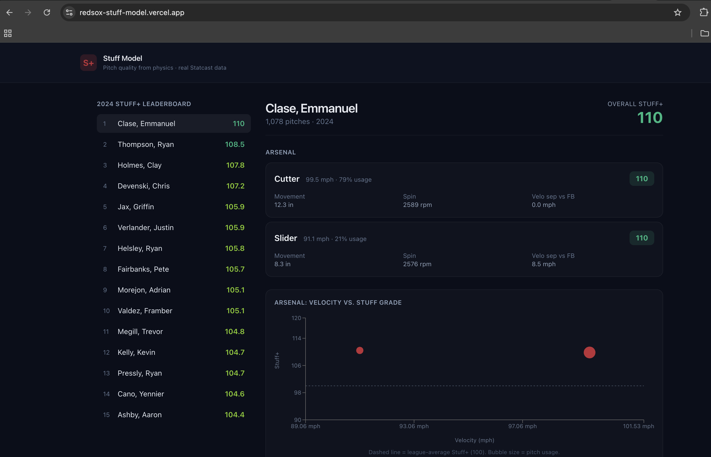
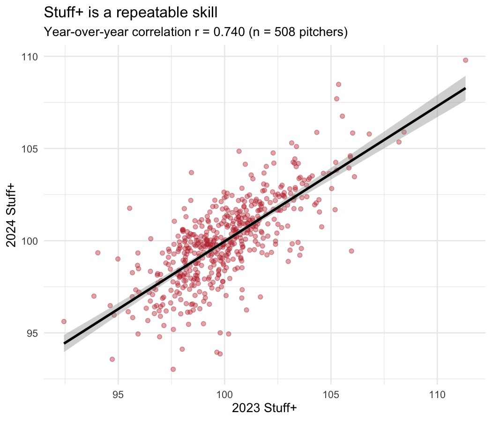
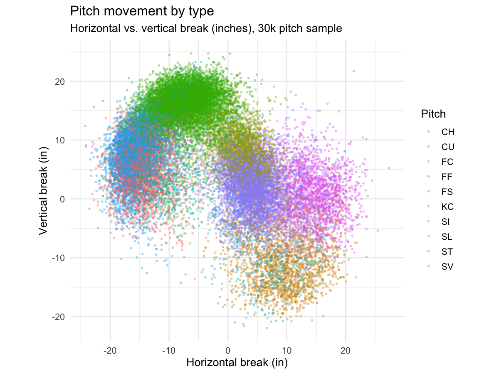

# Stuff Model — Grading MLB Pitch Quality from Physics

A machine-learning system that grades how nasty an MLB pitch is from its
**physical characteristics alone** — velocity, movement, spin, and release —
trained on **2.14 million real Statcast pitches** (2022–2024).

**Live dashboard:** https://redsox-stuff-model.vercel.app
*(first load may take ~40s while the free-tier API wakes up)*

*A scouting-report interface: the 2024 Stuff+ leaderboard, and any pitcher's arsenal broken down by pitch — grade, velocity, movement, spin, and separation off the fastball.*



---

## What it does

The model predicts the **run value** of a pitch from its physics, deliberately
excluding location, count, and batter — so it measures a pitch's *inherent
quality*, not the pitcher's command or the game situation. This is how modern
MLB front offices quantify "stuff." Predictions are rescaled to a **Stuff+**
grade where 100 = league average and higher is nastier.

### Does it actually work?

Three independent checks say yes:

**1. It ranks pitches correctly on a season it never saw.** Trained on
2022–2023 and tested on held-out 2024, binning pitches by predicted stuff
produces a clean monotonic relationship with *actual* run value — the best-graded
decile allowed ~4x less run value than the worst.

**2. Stuff+ is a stable, repeatable skill.** Year-over-year reliability
(2023 → 2024) is **r = 0.740** across 508 pitchers (p ≈ 1e-89) — proving stuff
is a real pitcher trait, not season-to-season noise. This is the core reason
front offices trust stuff metrics over volatile results-based stats.



**3. Its leaderboard matches expert consensus.** The top 2024 Stuff+ grades go
to Emmanuel Clase, Clay Holmes, Ryan Helsley, Pete Fairbanks, and Justin
Verlander — genuinely among the nastiest arms in baseball. The model identified
them from physics alone, without being told who's good.

### What drives a good pitch?

SHAP analysis shows the single biggest driver of stuff is **how differently a
pitch moves from the pitcher's own fastball** — an engineered, pitcher-relative
feature — followed by velocity separation off the fastball. The model leaned
hardest on baseball domain knowledge, not just raw numbers.



---

## Phase 2: from grading to decisions

A grade tells you what a pitch *is*. A front office needs to know what to *do* about it. Four analytics layers turn the model into a decision tool:

**Pitch Lab - prescriptive pitch design.** Inverts the model: sweeps each physical trait across a realistic range, re-scores every variant, and reports the single change that would most improve a pitch's grade. It flags that Clase's cutter projects a +6 Stuff+ gain with three fewer inches of vertical break. Descriptive becomes prescriptive.

**Undervalued Arms - a Moneyball layer.** Because stuff is stable (r = 0.74) and results are noisy, a pitcher whose stuff far outranks his actual run prevention is a buy-low candidate whose results should regress toward the stuff. The board ranks those divergences in both directions as a screening tool for closer looks.

**Risers & Fallers - year-over-year trends.** Tracks each pitcher's Stuff+ change from 2023 to 2024. Gains flag breakouts and development wins; drops flag possible fatigue, aging, or injury. It correctly surfaces Michael Kopech's breakout and the expected decliners.

**Similar Arms - scouting comps.** Nearest-neighbor search over each pitcher's arsenal physics answers "who else throws like this?" Comps for Emmanuel Clase come back as Tyler Glasnow, Clay Holmes, and Pete Fairbanks - exactly the group of elite power arms a scout would name.

---

## Architecture

A full analytics platform, from raw data to a deployed front-office tool:

| Layer | What | Tech |
|-------|------|------|
| **Ingestion** | Pull raw Statcast, season by season, incrementally | `pybaseball`, Parquet |
| **Pipeline** | bronze → silver → gold; clean 2.14M pitches, handle handedness | pandas |
| **Run value** | Learn a count-value table + linear weights; value every pitch | pandas |
| **Features** | Pitcher-relative physics: movement/velo separation, tunneling | pandas |
| **Model** | Predict run value from physics; temporal validation | XGBoost |
| **Interpretability** | Stuff+ grade + SHAP drivers | SHAP |
| **Validation** | Year-over-year reliability + publication charts | **R**, ggplot2 |
| **Serving** | REST API over the graded data | FastAPI |
| **Dashboard** | Scouting interface: leaderboard, arsenals, charts | Next.js, Recharts |

Python for the pipeline and modeling, **R for statistical validation and
visualization** — mirroring how a real baseball R&D group splits the two.

---

## Running it

```bash
# 1. environment
python3 -m venv venv && source venv/bin/activate
pip install -r requirements.txt

# 2. pipeline (pulls real Statcast — takes a few minutes per season)
python pipeline/bronze.py 2022
python pipeline/bronze.py 2023
python pipeline/bronze.py 2024
python pipeline/silver.py
python pipeline/run_value.py
python pipeline/gold.py
python pipeline/features.py

# 3. model + grades
python model/train.py
python model/interpret.py
python model/build_serving_data.py

# 4. R validation (optional)
python model/export_for_r.py
Rscript analysis/stuff_validation.R

# 5. serve + dashboard
python -m uvicorn dashboard.api:app --port 8000
cd frontend && npm install && npm run dev
```

---

## Notes and future work

- **v1 run value** uses a count-based proxy (learned from ball-strike counts and
  outcome linear weights). The relative pitch valuation is sound; a phase-2
  upgrade would swap in full base-out (RE24) run expectancy for better absolute
  calibration.
- **Low per-pitch R²** is expected and correct: individual pitch outcomes are
  noise-dominated, so no model predicts a single pitch well. Value lives in the
  aggregate rank-ordering — which holds cleanly on held-out data. Published
  models (Stuff+, PitchingBot) share this property.
- **Delivered in Phase 2** (see above): pitch-design recommendations, an
  undervalued-arms Moneyball layer, year-over-year risers & fallers, and
  arsenal-similarity scouting comps. Still open: tunneling/deception analysis.

---

*Built with real, public MLB Statcast data via [pybaseball](https://github.com/jldbc/pybaseball).*